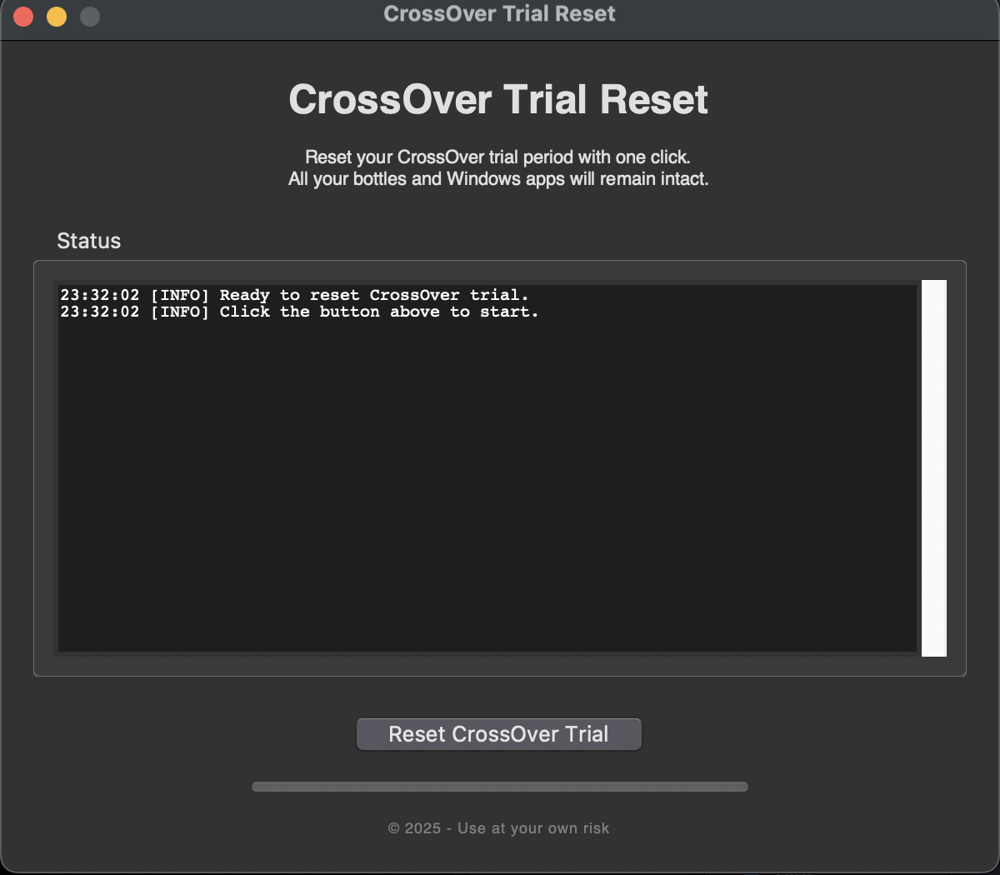
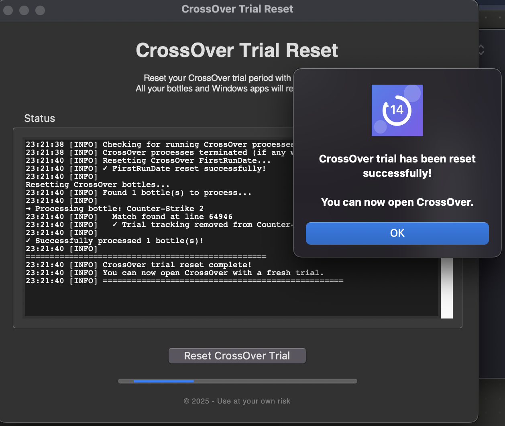

# CrossOver Trial Reset for Mac

<div align="center">


**Reset your CrossOver trial period with one click**

A simple, safe Mac application that resets CrossOver's trial period while keeping all your bottles and Windows applications intact.

[Download Latest Release](https://github.com/SoufyaneMoudabbbir/crossover-reset/releases/latest) • [Report Bug](https://github.com/SoufyaneMoudabbbir/crossover-reset/issues) • [Request Feature](https://github.com/SoufyaneMoudabbbir/crossover-reset/issues)

</div>

---

## 🎯 For Users: Download & Use

### Quick Start

1. **Download** the latest `CrossOver.Reset.app.zip` from [Releases](https://github.com/SoufyaneMoudabbbir/crossover-reset/releases)
2. **Unzip** the file
3. **Right-click** `CrossOver Reset.app` → Select **"Open"**
4. Click **"Open"** in the security dialog (only needed first time)
5. Click **"Reset CrossOver Trial"** button
6. Done! Open CrossOver with a fresh trial 🎉

### System Requirements

- macOS 10.13 (High Sierra) or later
- CrossOver must be installed and run at least once
- About 50MB disk space

### First-Time Security Note

macOS will show a security warning because the app isn't from the App Store. This is normal!

**Solution:**
- Right-click the app → **Open** → Click **"Open"**
- Or run: `xattr -cr "CrossOver Reset.app"`

You only need to do this once!

---

## ✨ Features

- ✅ **One-Click Reset** - Simple and fast
- ✅ **Safe Operation** - Keeps all bottles and Windows apps intact
- ✅ **No Installation** - Just download and run
- ✅ **Real-Time Progress** - See what's happening
- ✅ **Error Handling** - Clear error messages if something goes wrong
- ✅ **Native Look** - Uses macOS native interface

---

## 🛡️ What It Does (& Doesn't Do)

### ✅ Does:
- Resets CrossOver FirstRunDate in preferences
- Removes trial tracking from bottle registry files
- Shows progress and status messages

### ❌ Does NOT:
- Delete any bottles
- Remove installed Windows applications
- Modify any user data or files
- Access the internet or send data anywhere

**Your data is completely safe!**

---

## 🖼️ Screenshots
<div align="center">

### Main Window



### Success


</div>

## 💻 For Developers: Build From Source

### Prerequisites

- Python 3.8 or later
- Xcode Command Line Tools: `xcode-select --install`
- py2app or PyInstaller

### Quick Build

```bash
# 1. Clone the repository
git clone https://github.com/SoufyaneMoudabbbir/crossover-reset.git
cd crossover-reset

# 2. Make scripts executable
chmod +x build.sh check_ready.py make_icon.sh

# 3. Check requirements
./check_ready.py

# 4. Build the app
./build.sh

# 5. Test
open "dist/CrossOver Reset.app"
```

### Build Methods

**Option A: Automated (Recommended)**
```bash
./build.sh
```

**Option B: py2app**
```bash
pip3 install py2app
python3 setup.py py2app
```

**Option C: PyInstaller**
```bash
pip3 install pyinstaller
pyinstaller --name="CrossOver Reset" --windowed --onefile crossover_reset_gui.py
```

### Project Structure

```
crossover-reset/
├── crossover_reset_gui.py    # Main GUI application
├── setup.py                  # py2app configuration
├── build.sh                  # Automated build script
├── check_ready.py           # Pre-flight checker
├── make_icon.sh             # Icon generator
└── README.md                # This file
```

---

## 📖 Documentation

- **[Quick Start Guide](QUICKSTART.md)** - Fast build instructions
- **[Project Overview](PROJECT_OVERVIEW.md)** - Technical details
- **[Contributing Guidelines](CONTRIBUTING.md)** - How to contribute

---

## 🤝 Contributing

Contributions are welcome! Please feel free to submit a Pull Request.

1. Fork the repository
2. Create your feature branch (`git checkout -b feature/AmazingFeature`)
3. Commit your changes (`git commit -m 'Add some AmazingFeature'`)
4. Push to the branch (`git push origin feature/AmazingFeature`)
5. Open a Pull Request

---

## 📝 License

This project is licensed under the MIT License - see the [LICENSE](LICENSE) file for details.

---

## ⚠️ Disclaimer

This software is provided "as is" for educational purposes. Use at your own risk. Always backup important data before using system modification tools.

This project is not affiliated with, endorsed by, or sponsored by CodeWeavers Inc. CrossOver is a registered trademark of CodeWeavers Inc.

---

## 🙏 Acknowledgments

- Built with Python and tkinter
- Packaged with py2app/PyInstaller
- Inspired by the need for a simple, safe CrossOver trial reset tool

---

## 📞 Support

- **Issues:** [GitHub Issues](https://github.com/SoufyaneMoudabbbir/crossover-reset/issues)
- **Questions:** Create a discussion in the repository

---

<div align="center">

**Made with ❤️ for Mac users**

⭐ Star this repo if it helped you!

</div>
